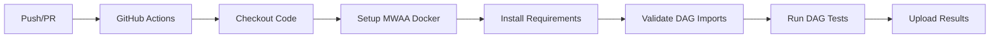

# Architecture Documentation

## Overview

The `airflow-ci-tools` repository provides a simple, reusable CI/CD solution for Apache Airflow DAG projects deployed on AWS MWAA.

## Design Principles

1. **Simplicity**: Use bash scripts and standard tools
2. **MWAA Compatibility**: Use official AWS MWAA Docker images
3. **Reusability**: GitHub Actions workflows can be called from any repository
4. **Version Flexibility**: Support multiple Airflow versions
5. **Minimal Dependencies**: Docker + Bash + Python (no complex frameworks)

## Architecture Components

### 1. GitHub Actions Workflow (`.github/workflows/validate-dags.yml`)

**Purpose**: Reusable workflow that other repositories can call

**Key Features**:
- Accepts parameters (airflow version, DAGs path, environment variables)
- Caches Docker layers for faster builds
- Uploads validation results as artifacts

**Usage Pattern**:
```yaml
uses: your-org/airflow-ci-tools/.github/workflows/validate-dags.yml@main
```

### 2. Docker Setup (`scripts/setup-mwaa-docker.sh`)

**Purpose**: Clone and build MWAA Docker images

**Process**:
1. Clones `aws/amazon-mwaa-docker-images` repository
2. Navigates to specific Airflow version directory
3. Builds Docker image with CI-specific docker-compose
4. Tags image as `mwaa-local:VERSION`

**Why MWAA Images?**:
- Exact runtime environment as AWS MWAA
- Includes all MWAA-specific configurations
- Maintained by AWS

### 3. DAG Validation (`scripts/validate-dag-imports.sh`)

**Purpose**: Validate DAG imports and syntax

**Validation Steps**:
1. Mount DAGs directory into container
2. Run Python validation script
3. Use Airflow's DagBag to parse DAGs
4. Check for import errors and cycles
5. Generate JSON report

**Output**: `validation-results/validation_results.json`

### 4. DAG Testing (`scripts/run-dag-tests.sh`)

**Purpose**: Run Airflow CLI tests on DAGs

**Test Process**:
1. Start Airflow container with mounted DAGs
2. Initialize Airflow database
3. List all DAGs
4. Run `airflow dags test` for each DAG
5. Generate test report

**Output**: `validation-results/test_report.txt`

## Integration Patterns

### Pattern 1: GitHub Actions (Recommended)

**Pros**:
- No setup required in consuming repository
- Centralized updates
- Version controlled

**Implementation**:
- Repository calls reusable workflow
- Workflow runs in GitHub Actions runner
- Results uploaded as artifacts

### Pattern 2: Docker Image

**Alternative approach** (not implemented but possible):
- Build and publish Docker image with all tools
- Consuming repositories pull and run image

### Pattern 3: Git Submodule

**Alternative approach** (not recommended):
- Add as git submodule
- More complex for users

## Directory Structure

```
airflow-ci-tools/
├── .github/workflows/       # Reusable GitHub Actions
│   └── validate-dags.yml   # Main workflow
├── config/                  # Configuration files
│   ├── airflow-versions.json
│   └── mwaa-environment.env
├── scripts/                 # Core scripts
│   ├── setup-mwaa-docker.sh
│   ├── validate-dag-imports.sh
│   ├── run-dag-tests.sh
│   └── install-requirements.sh
├── examples/               # Example usage
│   └── sample-dag-project/
└── docs/                   # Documentation
```

## Version Management

**Supported Versions**: Defined in `config/airflow-versions.json`

**Version Selection**:
1. User specifies version in workflow call
2. Script checks if version exists in MWAA repo
3. Builds specific version Docker image
4. Runs tests with that version

## Environment Simulation

**MWAA Environment Variables**:
- Loaded from `config/mwaa-environment.env`
- Simulates MWAA runtime configuration
- Can be overridden by user

**Custom Variables**:
- Passed via `environment-vars` parameter
- Loaded into container at runtime
- Supports secrets and configuration

## CI/CD Flow



## Maintenance

**Updating Airflow Versions**:
1. AWS releases new MWAA version
2. Update `config/airflow-versions.json`
3. Test with new version
4. No changes needed in consuming repositories

**Script Updates**:
1. Update scripts in this repository
2. All consumers automatically get updates
3. Version via git tags if needed

## Security Considerations

1. **Read-only DAG mounting**: DAGs mounted as read-only
2. **Container isolation**: Each test runs in isolated container
3. **No production access**: CI environment completely separated
4. **Secret handling**: Environment variables for sensitive data