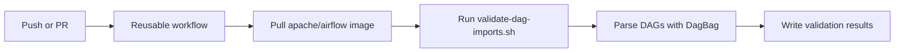

# Airflow CI Tools

Reusable CI helpers for validating Apache Airflow DAG imports with GitHub Actions and local Docker runs.

## Quick Start

Use the reusable workflow from your DAG repository:

```yaml
name: Validate DAGs

on: [push, pull_request]

jobs:
  validate:
    uses: your-org/airflow-ci-tools/.github/workflows/validate-dags.yml@main
    with:
      airflow-version: "2.9.2"
      dags-path: "dags"
```

## Features

- Validates DAG imports with Airflow's `DagBag`
- Supports optional extra Python requirements during validation
- Works in GitHub Actions and direct local Docker runs
- Keeps the implementation small with shell scripts

## Repository Structure

```text
airflow-ci-tools/
├── .github/workflows/validate-dags.yml
├── scripts/
│   └── validate-dag-imports.sh
└── README.md
```

## GitHub Actions

Add a workflow like this in the consuming repository:

```yaml
name: Validate Airflow DAGs

on: [push, pull_request]

jobs:
  validate:
    uses: your-org/airflow-ci-tools/.github/workflows/validate-dags.yml@main
    with:
      airflow-version: "2.9.2"
      dags-path: "dags"
      requirements-file: "requirements.txt"
      environment-vars: |
        ENVIRONMENT=dev
        AWS_REGION=us-east-1
```

### Supported Inputs

```yaml
with:
  airflow-version: "2.9.2"      # Required
  dags-path: "dags"             # Optional, default: dags
  python-version: "3.11"        # Optional
  requirements-file: "requirements.txt"
  environment-vars: |
    ENVIRONMENT=staging
    AWS_REGION=us-east-1
```

`requirements-file` is passed directly to `scripts/validate-dag-imports.sh`, which installs those packages inside the Airflow container before running validation.

## Local Usage

Run the same validation script directly:

```bash
./scripts/validate-dag-imports.sh \
  --version 2.9.2 \
  --dags-path /path/to/dags \
  --requirements /path/to/requirements.txt
```

## Environment Variables

You can pass extra variables through GitHub Actions:

```yaml
environment-vars: |
  MY_VAR=value
  SECRET=${{ secrets.MY_SECRET }}
```

For local runs, place the same content in `.env.custom` in the repository root.

## Validation Output

Successful validation prints each imported DAG and a summary of valid, invalid, and skipped DAGs. Import errors are reported as warnings because CI environments often omit optional Variables or external dependencies.

## Troubleshooting

### Docker is unavailable

Start Docker Desktop or the local Docker daemon, then rerun the script.

### DAG imports fail because of missing packages

Provide a `requirements-file` input in GitHub Actions or pass `--requirements` to `scripts/validate-dag-imports.sh`.

### No DAGs are discovered

Confirm the path is correct, the directory contains `.py` files, and those files create DAG objects that Airflow can import.

## Architecture

`airflow-ci-tools` is centered on a single reusable GitHub Actions workflow that validates Airflow DAG imports inside an official Apache Airflow Docker container.

### Reusable workflow

File: `.github/workflows/validate-dags.yml`

Responsibilities:
- checks out the caller repository
- checks out this tools repository into `.airflow-ci-tools`
- optionally writes `.env.custom` from `environment-vars`
- pulls the requested Airflow image
- runs `scripts/validate-dag-imports.sh`

The workflow currently performs import validation only. It does not call the local test wrapper or the MWAA setup script.

### Import validation

File: `scripts/validate-dag-imports.sh`

Responsibilities:
- mounts the DAG directory into a container
- optionally installs user-supplied requirements
- builds a temporary Python validator around Airflow's `DagBag`
- reports valid DAGs, invalid DAGs, and import warnings
- writes `validation-results/validation_results.json`

Import warnings are intentionally non-fatal because many CI environments do not expose every Airflow Variable or external dependency required by production DAGs.

## Execution Flow



## Maintenance Notes

- Keep workflow documentation aligned with the actual scripts it invokes.
- If DAG testing becomes part of CI later, add it to `.github/workflows/validate-dags.yml` and document the extra script or workflow step at the same time.

## Requirements

- Docker
- Bash
